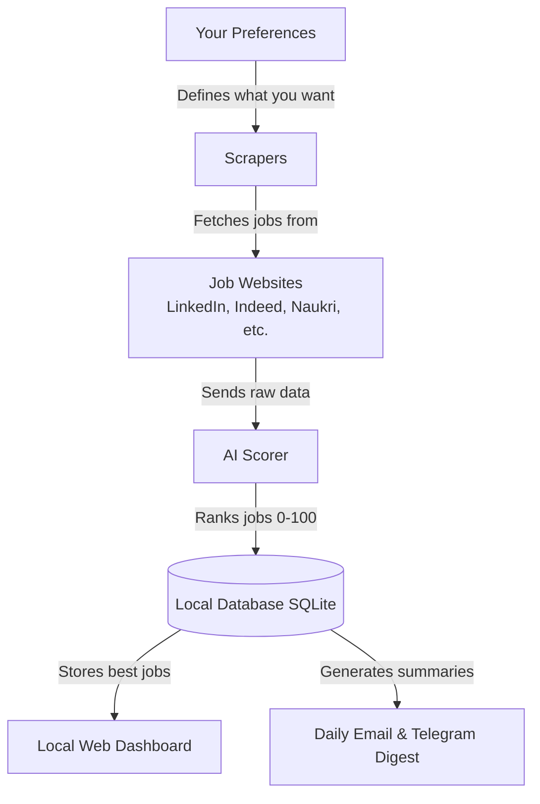
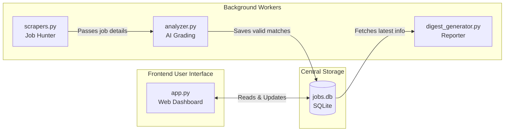

# Job Search Agent 🕵️‍♂️📈

Think of this tool as your **personal job hunting assistant** that runs on your laptop. You tell it what kind of jobs you're looking for, and it goes out every day, searches multiple job websites, filters out the noise, and brings back only the best matches for you!

## 🧩 How It Works (The Big Picture)



### The Daily Routine
1. **Scrape:** It visits websites like LinkedIn, Indeed, Naukri, HiringCafe, Wellfound, and IIMJobs to search for your job titles in your preferred locations.
2. **Score:** Every job gets a relevance score (0-100) using AI. Jobs that don't match your background are hidden.
3. **Store:** All good jobs are saved cleanly in a standard local database. It automatically throws away duplicate jobs.
4. **Digest:** The top jobs are packaged into a nice summary that you can view on the web dashboard or receive via Email/Telegram.

## 🏗️ How the Project is Built



- **`app.py`:** Runs the website you interact with locally (your personal web dashboard at `http://localhost:5001`).
- **`scrapers.py`:** The "Job Hunter" that visits job portals and pulls data without you doing it manually.
- **`analyzer.py`:** The "Scorer" that uses local AI (Ollama/Mistral) or a smart keyword point system to grade each job's relevance.
- **`database.py`:** Your private filing cabinet. Everything stays 100% on your laptop. No data is stored in the cloud.
- **`scheduler.py`:** The alarm clock that triggers the whole process automatically every day at a specific time.

## 🚀 Quick Start

1. **Install Dependencies:**
   ```bash
   pip install -r requirements.txt
   ```
2. **Run the Application:**
   ```bash
   python main.py
   ```
3. **Open the Web Dashboard:** Once `app.py` is running, open the UI in your browser and manage your preferences, view the job database, and upload your resume!

Your entire job search is now fully automated. Happy hunting! 🎉
